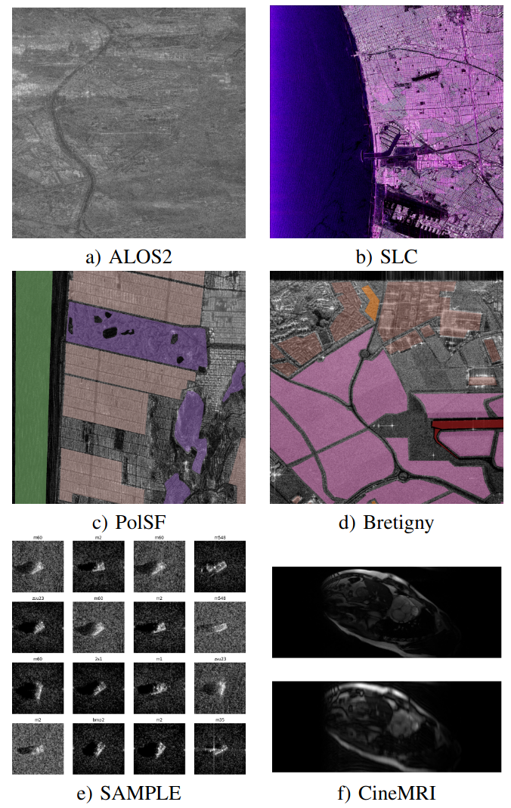
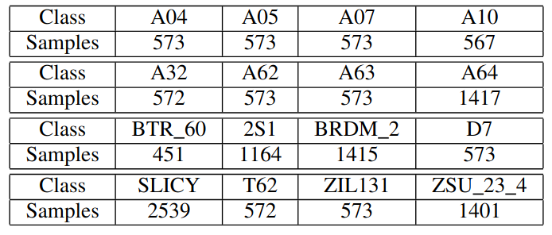
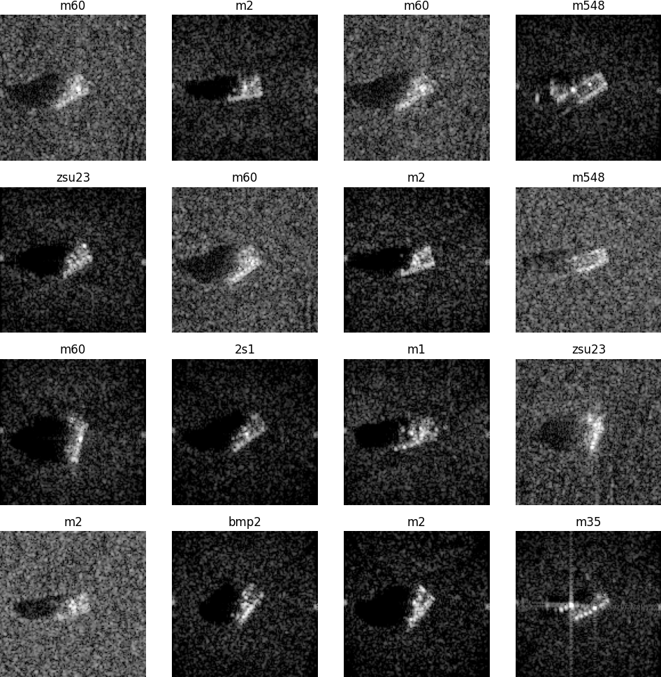
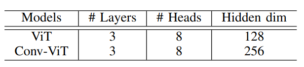
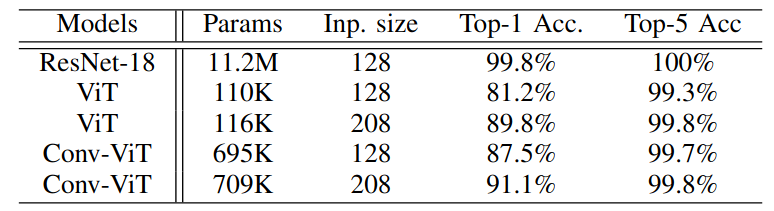
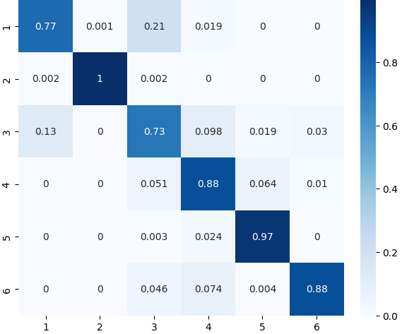
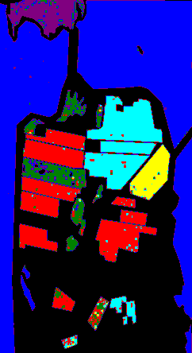
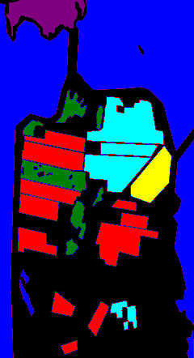
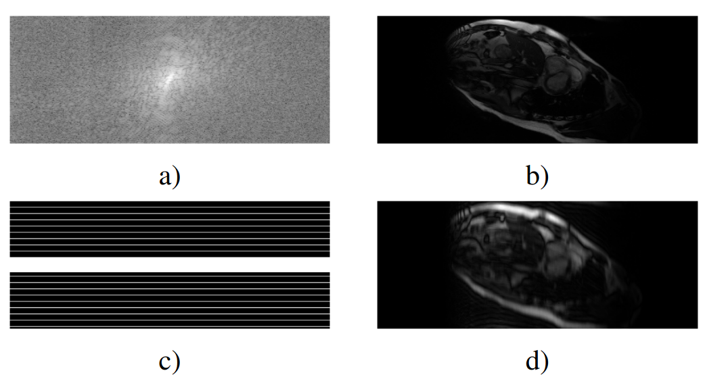

# Introduction

## What is the point ?

Several domains involve complex valued data: remote sensing [@Barrachina2022], MRI [@Virtue2019],[@Solomon2024],[@Hemidi2023], optics [@Dinsdale2021].

Pytorch already implements complex valued gradient descent ([Wirtinger Calculus](https://pytorch.org/docs/stable/notes/autograd.html#autograd-for-complex-numbers)) but lacks several complex valued capabilities such as **datasets**, **cv-activations**, **layers**, **initialization functions**


. . . 

__Objective__: **robust, easy to use, complex valued neural networks + data loaders for PyTorch**. 

Existing frameworks :

- Tensorflow: [https://github.com/NEGU93/cvnn](https://github.com/NEGU93/cvnn) [@Barrachina2022]
- Pytorch: [complexPyTorch](https://github.com/wavefrontshaping/complexPyTorch) [@Matthes2021], [cplxmodule](https://github.com/ivannz/cplxmodule) [@Nazarov2019], [pytorch-complex](https://github.com/Roger-luo/pytorch-complex) (archived since 2019)

<!--

- to explore complex valued neural networks
- to provide a common implementation for benchmarking

-->


# Core components

## Datasets

::: {.w3-row}
::: {.w3-twothird}

Available [datasets](https://torchcvnn.github.io/torchcvnn/modules/datasets.html) :

- ALOS2/SLC formats
- Semantic segmentation : PolSF, Bretigny
- Classification : MSTAR/SAMPLE
- Reconstruction : CineMRI (MICCAI)

See [https://torchcvnn.github.io/torchcvnn/modules/datasets.html](https://torchcvnn.github.io/torchcvnn/modules/datasets.html)

```python
import numpy as np
import torchcvnn
from torchcvnn.datasets.slc.dataset import SLCDataset

def get_pauli(data):
    # Returns Pauli in (H, W, C)
    HH = data["HH"]
    HV = data["HV"]
    VH = data["VH"]
    VV = data["VV"]

    alpha = HH + VV
    beta = HH - VV
    gamma = HV + VH

    return np.stack([beta, gamma, alpha], axis=-1)


patch_size = (3000, 3000)
dataset = SLCDataset(
    rootdir,
    transform=get_pauli,
    patch_size=patch_size,
)
```

::: 
::: {.w3-third}



::: 
::: 


## Activation functions

Activation functions can be of different types :

- split activation functions, ndependently applied on both $\mathfrak{R}(z)$,
  $\mathfrak{I}(z)$ :
  CReLU, CPReLU, CTanh, ... `IndependentRealImag`

```python

from torchcvnn.nn import IndependentRealImag


CGELU = torchcvnn.IndependentRealImag(nn.GELU)

```


- taking into account both the magnitude and phase: Cardioid[@Virtue2019], Mod, modReLU,
  zAbsReLU, zLeakyReLU, zReLU

See [https://torchcvnn.github.io/torchcvnn/modules/nn.html#activations](https://torchcvnn.github.io/torchcvnn/modules/nn.html#activations)

## Pooling, dropout, normalization layers

- [Dropout layers](https://torchcvnn.github.io/torchcvnn/modules/nn.html#dropout-layers) : Dropout, Dropout2d
- [Pooling layers](https://torchcvnn.github.io/torchcvnn/modules/nn.html#pooling-layers) : MaxPool2d (on mod), AvgPool2d,
- [UpSampling layers](https://torchcvnn.github.io/torchcvnn/modules/nn.html#upsampling-layers) : ConvTranspose2d, Upsample
- [Normalization layers](https://torchcvnn.github.io/torchcvnn/modules/nn.html#normalization-layers) : BatchNorm{1d,2d}, LayerNorm, RMSNorm

--- TBD equations ---

## Attention layers and transformers

- ViT : Vision transformers


# Use case : MSTAR classification with CV-CNNs and CV-ViTs

## Problem

::: {.w3-row}
::: {.w3-half}

- $\approx 14k$ images, $16$ classes, 
- $80\%$ for training, $20\%$ for validation, AdamW($\epsilon=0.003$, $\lambda=0.05$)
- image sizes $54\times 54 \rightarrow 193\times 193$  are FFT-resized
- magnitudes converted to dB scale, phase unchanged

:::
::: {.w3-half}



:::
:::

::: {.w3-row}
::: {.w3-half}


```python

import torchcvnn
from torchcvnn.datasets import MSTARTargets
from torchcvnn.transforms import HWC2CHW, LogAmplitude, ToTensor, FFTResize

size = 128

transform = v2.Compose(
    [HWC2CHW(), FFTResize((size, size)), 
	 LogAmplitude(), ToTensor('complex64')]
)

dataset = MSTARTargets(
    rootdir, transform=transform
)
X, y = dataset[0]


```


:::
::: {.w3-half}

{width=50%}

:::
:::

Soure code : [https://github.com/torchcvnn/examples/tree/main/mstar_classification/](https://github.com/torchcvnn/examples/tree/main/mstar_classification/)

## Models and performances

::: {.w3-row}
::: {.w3-half}

- Pretrained real-valued resnet18 (e.g. timm) can be loaded and patched to complex

```python

complex_valued_model = convert_to_complex(resnet18())

def convert_to_complex(module: nn.Module) -> nn.Module:
    cdtype = torch.complex64
    for name, child in module.named_children():
        if isinstance(child, nn.Conv2d):
            setattr(module, name, nn.Conv2d(..., dtype=cdtype))
        elif isinstance(child, nn.ReLU):
            setattr(module, name, c_nn.modReLU())
        elif isinstance(child, nn.BatchNorm2d):
            setattr(module, name, c_nn.BatchNorm2d(child.num_features))
        ....
        else:
            convert_to_complex(child)
```

:::
::: {.w3-half}





:::
:::

- Implement your own complex valued neural network, e.g. CV-VIT, see [mstar_classification/models.py:VisionTransformer](https://github.com/torchcvnn/examples/blob/9ba0042f9d7f0be911fe7fd26dc4b3479a85c0bd/mstar_classification/model.py#L291-L359)

	- embedding with an optional ConvSTEM (Hybrid VIT), on patches $16\times 16$
	- complex valued attention by [@Eilers2023]
	- additional class token, on which the classification head is connected


# Use case : PolSAR reconstruction with CV-AEs

## Problem

blabla

## Models

# Use case : Semantic segmentation with CV-UNet

## Problem

- ALOS2 [Polarimetric San Francisco](https://ietr-lab.univ-rennes1.fr/polsarpro-bio/san-francisco/),
- semantic segmentation with $6$ classes (+unlabel), $4000 \times 2000$
- non overlapping split, train($70\%$), valid($15\%$), test($15\%$)
- AdamW($\epsilon=0.001$, $\lambda=0.005$)

::: {.w3-row}
::: {.w3-half}

```python
import torchcvnn
from torchcvnn.datasets import PolSFDataset

def transform_patches(patches):
    # We keep all the patches and get the spectrum
    # from it
    # If you wish, you could filter out some polarizations
    # PolSF provides the four HH, HV, VH, VV
    patches = [np.abs(patchi) for _, patchi in patches.items()]
    return np.stack(patches)

dataset = PolSFDataset(rootdir, patch_size=((512, 512)), patch_stride=((512, 512)), transform=transform_patches
X, y = dataset[0]
```

:::
::: {.w3-half}


:::
:::

Source code : [https://https://github.com/torchcvnn/examples/tree/main/polsf_unet](https://github.com/torchcvnn/examples/tree/main/polsf_unet)

## Model and performances

- Complex valued UNet with $5$ encoder and $5$ decoder blocks, $52$M params
- Encoder with $2\times$ Conv-BatchNorm-modReLU residual blocks, kernel size $3$, StridedConv
  downsampling
- Decoder with bilinear upsampling, concat and $2$ residual blocks

::: {.w3-row}
::: {.w3-third}



:::
::: {.w3-third}



:::
::: {.w3-third}



:::
:::

# Use case : Neural Implicit Representation (NIR) for Cardiac reconstruction

## Problem

- In cardiac MRI, Fourier space is sampled by bands,
- more time is more bands is better resolution
- **Objective**:  reconstruct the image $\mathbf{I} \in \mathbb{C}^{N_x\times N_y}$ from the partially observed $k$-space $\mathbf{K} \in \mathbb{C}^{N_x\times N_y\times N_c}$ ($N_c$ coils)

- From CINEJense [@Hemidi2023] based on Instand Neural Graphic Primitives [@mueller2022]. No training, only inference.
- 2D+t input coordinates $(x, y, t)$ with real-valued multi-resolution hash encoding
- $2$ INR networks : image $\mathbf{I}_\theta^t(x,y)$ and coil's sensitivity $\mathbf{S}_\psi^{t,c}(x,y)$.
- INR = coordinates encoding + MLP (modReLU)

::: {.w3-row}
::: {.w3-half}

![Architecture of CINEJense [@Hemidi2023]](https://raw.githubusercontent.com/MDL-UzL/CineJENSE/refs/heads/main/images/CineJense_arch.png)

:::
::: {.w3-half}



:::
:::

Source code : [https://github.com/torchcvnn/examples/tree/main/nir_cinejense](https://github.com/torchcvnn/examples/tree/main/nir_cinejense)

## Model and performances

- Reconstruction loss with total variation regularizer
$$
\left(\hat{\theta}, \hat{\psi}\right)  =  \mbox{argmin}_{\theta, \psi} \frac{1}{N_cT}\sum_{\substack{c=0\\t=0}}^{\substack{T-1\\N_c-1}} L_\delta\left(\mathbf{M} \odot \mathcal{F}\left(\mathbf{I}_\theta^{t}\odot \mathbf{S}_\psi^{t,c}\right), \mathbf{K}^{t,c}\right) + \lambda \|\nabla \mathbf{I}_\theta^{t,c}\|_1\, ,
    \label{eq:cinejense}
$$

- The reconstruction combines the prediction with the partially observed k-space
  sampled arbitrarily over $X\times Y \times T$.

- Examples with acceleration factor $4$ (top), and $10$ (bottom)

{width=75%}

{width=75%}

# Conclusion

## Perspectives 

Two PhDs currently investigating :

- Complex valued generative models - Quentin Gabot, Poster 10
- Complex valued anomaly detection - Huy Nguyen, Poster P11


<!-- 

Two master students on :

- Modeling spiking neural networks with complex valued neural networks
- Self supervized pre-training

-->

More models, more datasets, more approaches

- Complex valued coordinates encoding (e.g. Hash encoding)
- Complex valued VAE : generative modeling
- Complex valued segmentation transformer : SegFormer
- Additional datasets supports : [S1SLC](https://ieee-dataport.org/open-access/s1slccvdl-complex-valued-annotated-single-look-complex-sentinel-1-sar-dataset-complex)

## Thanks

Thank you for your attention.

- Library available on [https://github.com/torchcvnn](https://github.com/torchcvnn),
- Examples available on [https://github.com/torchcvnn/examples](https://github.com/torchcvnn/examples),
- Documentation on [https://torchcvnn.github.io/torchcvnn/](https://torchcvnn.github.io/torchcvnn/),
- Code coverage on [https://torchcvnn.github.io/torchcvnn/htmlcov/](https://torchcvnn.github.io/torchcvnn/htmlcov/),
- Unit tests with pytest.

Join us in this effort, your contributions are welcome.

To be presented at [IJCNN 2025 (Roma) : Complex- and Hypercomplex- valued Neural Networks](https://www.ime.unicamp.br/~valle/CFPs/ijcnn2025)

__Contact__: jeremy.fix@centralesupelec.fr


# References

## Bibliography
