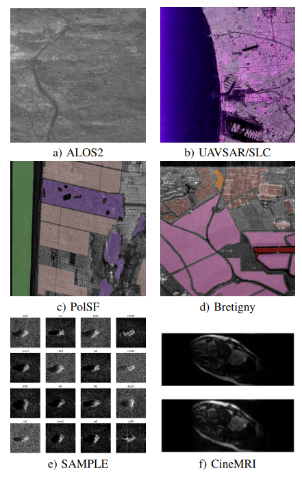

# Introduction

## What is the point ?

Several domains involve complex valued data: remote sensing [@Barrachina2022], MRI [@Virtue2019],[@Solomon2024],[@Hemidi2023], optics [@Dinsdale2021].

Pytorch already implements complex valued gradient descent ([Wirtinger Calculus](https://pytorch.org/docs/stable/notes/autograd.html#autograd-for-complex-numbers)) but lacks several complex valued capabilities such as **datasets**, **cv-activations**, **layers**, **initialization functions**


. . . 

__Objective__: **robust, easy to use, complex valued neural networks + data loaders for PyTorch**. 

Existing frameworks :

- Tensorflow: [https://github.com/NEGU93/cvnn](https://github.com/NEGU93/cvnn) [@Barrachina2022]
- Pytorch: [complexPyTorch](https://github.com/wavefrontshaping/complexPyTorch) [@Matthes2021], [cplxmodule](https://github.com/ivannz/cplxmodule) [@Nazarov2019], [pytorch-complex](https://github.com/Roger-luo/pytorch-complex) (archived since 2019)


# Core components

## Datasets

::: {.w3-row}
::: {.w3-twothird}

Available [datasets](https://torchcvnn.github.io/torchcvnn/modules/datasets.html) :

- ALOS2/SLC formats
- Semantic segmentation : PolSF, Bretigny
- Classification : MSTAR/SAMPLE
- Reconstruction : CineMRI (MICCAI)

See [https://torchcvnn.github.io/torchcvnn/modules/datasets.html](https://torchcvnn.github.io/torchcvnn/modules/datasets.html)

```python
import numpy as np
import torchcvnn
from torchcvnn.datasets.slc.dataset import SLCDataset

def get_pauli(data):
    # Returns Pauli in (H, W, C)
    HH = data["HH"]
    HV = data["HV"]
    VH = data["VH"]
    VV = data["VV"]

    alpha = HH + VV
    beta = HH - VV
    gamma = HV + VH

    return np.stack([beta, gamma, alpha], axis=-1)


patch_size = (3000, 3000)
dataset = SLCDataset(
    rootdir,
    transform=get_pauli,
    patch_size=patch_size,
)
```

::: 
::: {.w3-third}



::: 
::: 


## Activation functions

Activation functions can be of different types :

- split activation functions, ndependently applied on both $\mathfrak{R}(z)$,
  $\mathfrak{I}(z)$ :
  CReLU, CPReLU, CTanh, ... `IndependentRealImag`

```python

from torchcvnn.nn import IndependentRealImag


CGELU = torchcvnn.IndependentRealImag(nn.GELU)

```


- taking into account both the magnitude and phase: Cardioid[@Virtue2019], Mod, modReLU,
  zAbsReLU, zLeakyReLU, zReLU

See [https://torchcvnn.github.io/torchcvnn/modules/nn.html#activations](https://torchcvnn.github.io/torchcvnn/modules/nn.html#activations)

## Pooling, dropout, normalization layers

- [Dropout layers](https://torchcvnn.github.io/torchcvnn/modules/nn.html#dropout-layers) : Dropout, Dropout2d
- [Pooling layers](https://torchcvnn.github.io/torchcvnn/modules/nn.html#pooling-layers) : MaxPool2d (on mod), AvgPool2d,
- [UpSampling layers](https://torchcvnn.github.io/torchcvnn/modules/nn.html#upsampling-layers) : ConvTranspose2d, Upsample
- [Normalization layers](https://torchcvnn.github.io/torchcvnn/modules/nn.html#normalization-layers) : BatchNorm{1d,2d}, LayerNorm, RMSNorm

--- TBD equations ---

## Attention layers and transformers

- ViT : Vision transformers


# Use case : MSTAR classification with CV-CNNs and CV-ViTs

## Problem

## Model

blabla

# Use case : PolSAR reconstruction with CV-AEs

## Problem

blabla

## Models

# Use case : Semantic segmentation with CV-UNet

## Problem

# Use case : Neural Implicit Representation for Cardiac reconstruction

## Problem

# Conclusion

## Perspectives 

Two PhDs currently investigating :

- Complex valued generative models - Quentin Gabot
- Complex valued anomaly detection - Huy Nguyen

More models, more datasets, more approaches

- Complex valued coordinates encoding (e.g. Hash encoding)
- Complex valued VAE : generative modeling
- Complex valued segmentation transformer : SegFormer
- Additional datasets supports : [S1SLC](https://ieee-dataport.org/open-access/s1slccvdl-complex-valued-annotated-single-look-complex-sentinel-1-sar-dataset-complex)

## Thanks

Thank you for your attention.

- Library available on [https://github.com/torchcvnn](https://github.com/torchcvnn),
- Examples available on [https://github.com/torchcvnn/examples](https://github.com/torchcvnn/examples),
- Documentation on [https://torchcvnn.github.io/torchcvnn/](https://torchcvnn.github.io/torchcvnn/),
- Code coverage on [https://torchcvnn.github.io/torchcvnn/htmlcov/](https://torchcvnn.github.io/torchcvnn/htmlcov/),
- Unit tests with pytest.

Join us in this effort, your contributions are welcome.

To be presented at [IJCNN 2025 (Roma) : Complex- and Hypercomplex- valued Neural Networks](https://www.ime.unicamp.br/~valle/CFPs/ijcnn2025)

__Contact__: jeremy.fix@centralesupelec.fr


# References

## Bibliography
